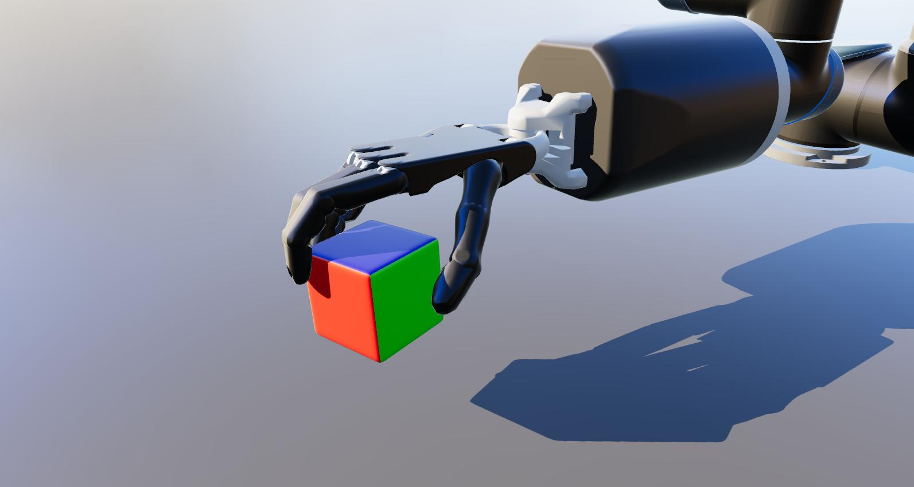

### Experimental research code used in our ROBIO 2021 paper

## Direct Policy Optimization with Differentiable Physical Consistency for Dexterous Manipulation 

#### Dependencies
- TAMSVIZ https://github.com/TAMS-Group/tamsviz
- Shadow and UR robot models
